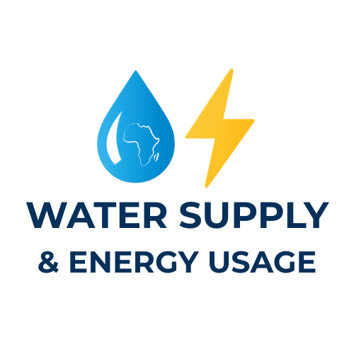

# Water Usage & Energy Supply App – Africa



**Crafted by: Benedict Ouma**
**Contact:** \[bogutu027@gmail.com]

---

## About the Creator

Hello! I’m **Benedict Ouma**, a data enthusiast passionate about using technology to solve real-world problems in Africa.

I created this app to empower policymakers, energy providers, and water management authorities with **data-driven insights**. My vision is to improve resource allocation, enhance solar energy adoption, and ensure sustainable water supply for communities across the continent.

This project is not just about numbers; it’s about **making life better for people and the environment** through intelligent analysis and interactive visualization.

---

## Overview

The **Water Usage & Energy Supply App** enables users to:

* Classify regions by solar panel performance
* Identify communities with critical water and energy needs
* Provide actionable insights for resource allocation
* Visualize patterns interactively using maps, charts, and heatmaps

The goal? **Promote sustainable development, efficiency, and better living conditions** across African regions.

---

## Features

### 1. Regional Classification for Solar Panel Optimization

* Predict **Low**, **Medium**, or **High** solar performance tiers per region.
* Uses a **Random Forest Classifier** trained on historical data.
* Assess how water supply sources affect energy efficiency.

### 2. Identification of Energy and Water Supply Needs

* Interactive **heat maps** of water and energy metrics.
* Spot regions with **high consumption but low access** or high costs.
* Prioritize communities needing immediate intervention.

### 3. Resource Allocation & Policy Recommendations

* Decision-support dashboard for policymakers and stakeholders.
* Suggestions for improving water infrastructure and energy distribution.
* Optimize **solar panel deployment** based on regional data.

### 4. Data Quality & Consistency Checks

* Soft warnings for missing columns or inconsistent data.
* Ensures uploaded files are ready for analysis without breaking the app.

### 5. Interactive Visualizations

* **Histograms**, **Bar Charts**, **Scatter Plots**, **Correlation Heatmaps**, **Folium Maps**.
* Filter by **state, LGA, latitude, longitude, or numeric ranges**.
* Designed to be intuitive for both technical and non-technical users.

### 6. File Handling & Download

* Upload **CSV** or **Excel** files.
* Download processed or filtered data in **CSV** or **Excel**.
* Soft warning messages prevent frightening red errors.

---

## Dataset

### Source

**Water Supply and Energy Usage Dataset – Africa**

### Description

This dataset includes information on:

* Water supply sources per region
* Energy usage metrics and solar panel performance
* Population, state, and geographic coordinates (latitude, longitude)

Each row represents a region, with attributes like:

* `lga`: Local Government Area
* `Average Nighttime mean`: Nighttime temperature
* `AREA`: Region size in square meters
* `Population`: Number of people
* Solar performance indicators and water source breakdowns

### Limitations

* Covers specific regions only; may not represent the entire continent.
* Snapshot in time; may not reflect current conditions.
* Users should verify data before relying on it for critical decisions.

---

## Installation & Setup

1. Clone the repository:

```bash
git clone <https://github.com/BenedictOuma/Water-Supply-and-Energy-Usage.git>
```

2. Create and activate a Python environment:

```bash
python -m venv venv
source venv/bin/activate   # Linux/Mac
venv\Scripts\activate      # Windows
```

3. Install dependencies:

```bash
pip install -r requirements.txt
```

4. Run the app:

```bash
streamlit run app.py
```

---

## How to Use

1. **Upload Data**

   * CSV or Excel formats supported.
   * Optional: manually enter values in the sidebar.

2. **Filter & Explore**

   * Select state, LGA, latitude, longitude, and numeric ranges.

3. **Predict Solar Tier**

   * Click **Predict** to classify the region’s solar performance.

4. **Visualize Data**

   * Choose visualization type: Histogram, Bar Chart, Scatter Plot, Correlation Heatmap, or Folium Map.
   * Customize the parameters and explore trends interactively.

5. **Download Data**

   * Save your filtered or processed data in CSV or Excel formats.

---

## Technical Details

* **Built by:** Benedict Ouma
* **Backend:** Python, Streamlit
* **Data Handling:** Pandas, GeoPandas
* **Machine Learning:** Scikit-learn (Random Forest, encoders, PCA, KMeans)
* **Visualization:** Matplotlib, Seaborn, Folium
* **Model Persistence:** Joblib

---

## Contributing

* Keep the app **intuitive and accessible**.
* Ensure uploaded files are **properly formatted**.
* Maintain encoding and preprocessing consistency when adding new features.
* Report issues directly to **Benedict Ouma** via email or GitHub.

---

## License

MIT License – © 2025 **Benedict Ouma**